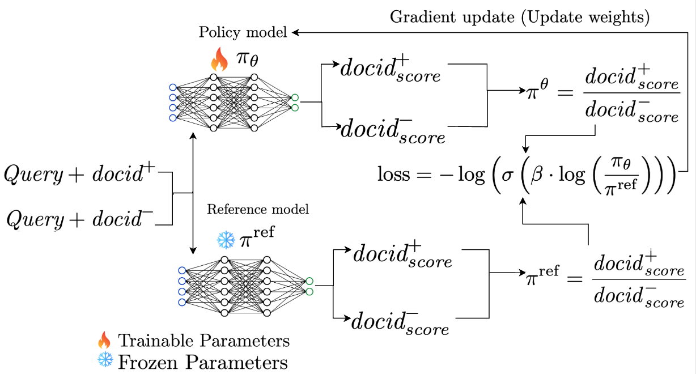

# DDRO: Direct Document Relevance Optimization for Generative IR

This repository contains the official implementation for our SIGIR 2025 paper:  
📄 **[Lightweight and Direct Document Relevance Optimization for Generative IR (DDRO)](https://arxiv.org/abs/2504.05181)**  




We propose a lightweight and effective optimization framework for generative IR that directly aligns document ID generation with document-level relevance using a pairwise ranking objective.

---

## 📁 Project Structure

```bash
src/
├── data/                # Data downloading, preprocessing, and docid instance generation
├── pretrain/            # DDRO model training and evaluation logic (incl. ddro)
├── scripts/             # Entry-point shell scripts for SFT, ddro, BM25, and preprocessing
├── utils/               # Core utilities (tokenization, trie, metrics, trainers)
├── ddro.yml             # Conda environment (for training DDRO)
├── pyserini.yml         # Conda environment (for BM25 retrieval with Pyserini)
├── README.md            # You're here!
└── requirements.txt     # Additional Python dependencies
```

Each subdirectory includes a README where needed.

---

## 🛠️ Setup & Dependencies

1. Clone the repo and install dependencies:
   ```bash
   git clone https://github.com/kidist-amde/ddro.git
   conda env create -f ddro.yml
   conda activate ddro
   ```

2. Download the datasets and T5 model:
   ```bash
   bash data/download/download_msmarco_datasets.sh
   bash data/download/download_nq_datasets.sh
   python data/download/download_t5_model.py
   ```

3. Place them into the following structure:
   ```
   resources/
   ├── datasets/
   │   ├── msmarco-data/
   │   └── nq-data/
   └── transformer_models/
       └── t5-base/
   ```

---

## Data Preparation

### ✅ For Natural Questions

Run the full NQ preparation pipeline:
```bash
bash scripts/preprocess/preprocess_nq_dataset.sh               # Cleans and merges NQ
bash scripts/preprocess/convert_nq_to_msmarco_format.sh        # Converts to MS MARCO style
bash scripts/preprocess/compute_nq_t5_embeddings.sh            # T5-based embeddings
bash scripts/preprocess/generate_nq_encoded_ids.sh             # Encode docids (URL, PQ, Atomic, Summary)
bash scripts/preprocess/generate_nq_eval_and_train_data.sh     # Eval/train file generation
```

### ✅ For MS MARCO

```bash
bash scripts/preprocess/sample_top_docs.sh
sbatch scripts/preprocess/generate_msmarco_t5_embeddings.sh
sbatch scripts/preprocess/generate_msmarco_encoded_ids.sh
```

---

## 🔁 Training Pipeline

The DDRO training proceeds in 3 stages. Use:

```bash
python utils/run_training_pipeline.py --encoding pq
```

It runs:
- Stage 1: Pretraining on document contents
- Stage 2: Pretraining on doc2query outputs
- Stage 3: Finetuning on BM25 negatives or labeled qrels

---

## 🔍 BM25 Retrieval Setup (Pyserini)

```bash
conda env create -f pyserini.yml
conda activate pyserini
pip install -r pyserini.txt
```

Run indexing and retrieval:
```bash
bash scripts/bm25/run_bm25_retrieval_nq.sh
bash scripts/bm25/run_bm25_retrieval_msmarco.sh
```

---

##  DDRO Training

See `scripts/ddro/` for lightweight pairwise fine-tuning using [HF's `DPOTrainer`](https://github.com/huggingface/trl).  
Example:
```bash
bash scripts/ddro/run_ddro_training.sh
bash scripts/ddro/run_test_ddro.sh
```

---


Evaluation logs and per-query metrics are saved under:
```
logs/
outputs/
```

---

## 📚 Datasets Used

- [MS MARCO Document Ranking](https://microsoft.github.io/msmarco/)
- [Natural Questions](https://ai.google.com/research/NaturalQuestions)

---
## 📂 Important Files and Checkpoints (Available on Hugging Face 🤗)

###  Document DocIDs
- 👉🏽 [ddro-docids on Hugging Face](https://huggingface.co/datasets/kiyam/ddro-docids)

###  Generated Pseudo Queries
- 👉🏽 [ddro-pseudo-queries on Hugging Face](https://huggingface.co/datasets/kiyam/ddro-pseudo-queries)

###  Model Checkpoints
- 👉🏽 [DDRO-Generative-Document-Retrieval Collection on Hugging Face](https://huggingface.co/collections/kiyam/ddro-generative-document-retrieval-680f63f2e9a72033598461c5)

This collection includes DDRO models trained on **MS MARCO** and **Natural Questions** datasets, across both **PQ** and **TU** docid strategies.

###  Preprocessed Dataset (Top-300K MS MARCO documents)
- 👉🏽 [ddro-msmarco-doc-dataset-300k on Hugging Face](https://huggingface.co/datasets/kiyam/ddro-msmarco-doc-dataset-300k)
---

## 🙏 Acknowledgments

We gratefully acknowledge these open-source projects:

- [ULTRON](https://github.com/smallporridge/WebUltron)
- [HuggingFace TRL](https://github.com/huggingface/trl)
- [NCI](https://github.com/solidsea98/Neural-Corpus-Indexer-NCI)
- [docTTTTTquery](https://github.com/castorini/docTTTTTquery)

---

## 📄 License

Licensed under the [Apache 2.0 License](LICENSE).

---

## 📌 Citation

```bibtex
@article{mekonnen2025lightweight,
  title={Lightweight and Direct Document Relevance Optimization for Generative Information Retrieval},
  author={Mekonnen, Kidist Amde and Tang, Yubao and de Rijke, Maarten},
  journal={arXiv preprint arXiv:2504.05181},
  year={2025}
}
```

---

## Contact

For questions, please open an [issue](https://github.com/kidist-amde/DDRO-Direct-Document-Relevance-Optimization/issues).


