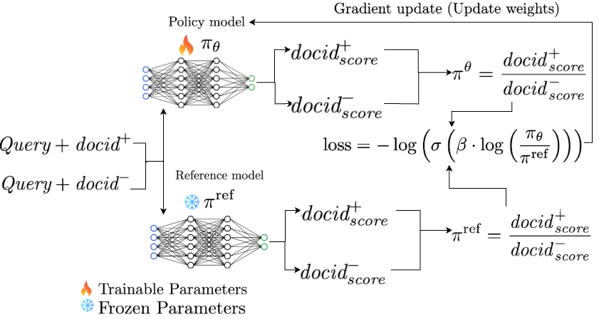
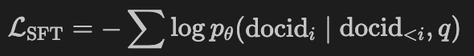
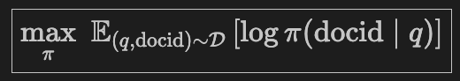
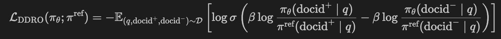
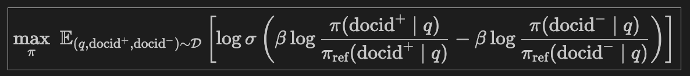

# DDRO: Direct Document Relevance Optimization for Generative Information Retrieval

[](https://arxiv.org/abs/2504.05181)
[](LICENSE)
[](https://huggingface.co/kiyam)

This repository contains the official implementation of our SIGIR 2025 paper:  
📄 **[Lightweight and Direct Document Relevance Optimization for Generative IR (DDRO)](https://arxiv.org/abs/2504.05181)**
 -  Optimizing Generative Retrieval with Ranking-Aligned Objectives 
<!-- --- -->
<!-- 
### 🚧 Repository Under Development

This repository is actively under development. Thanks for your patience, changes and improvements may be applied frequently. Stay tuned for updates! -->

---
## 📑 Table of Contents

- [Motivation](#motivation)
- [What DDRO Does](#what-ddro-does)
- [Learning Objectives](#learning-objectives-in-ddro)
- [🛠️ Setup & Dependencies - Steps to Reproduce 🎯](#1-install-environment)
- [Preprocessed Data & Model Checkpoints](#preprocessed-data--model-checkpoints)
- [🔬 Evaluate Pre-trained Models from HuggingFace
](#model-evaluation)
- [Citation](#citation)


## Motivation

**Misalignment in Learning Objectives:**  
Gen-IR models are typically trained via next-token prediction (cross-entropy loss) over docid tokens.  
While effective for language modeling, this objective:
- 🎯 Optimizes **token-level generation**
- ❌ Not designed for **document-level ranking**

As a result, Gen-IR models are not directly optimized for **learning-to-rank**, which is the core requirement in IR systems.


## What DDRO Does

In this work, we ask:

> _How can Gen-IR models directly learn to rank documents, instead of just predicting the next token?_

We propose **DDRO**:  
**Lightweight and Direct Document Relevance Optimization for Gen-IR**

### ✅ Key Contributions:
- Aligns training objective with ranking by using **pairwise preference learning**
- Trains the model to **prefer relevant documents over non-relevant ones**
- Bridges the gap between **autoregressive training** and **ranking-based optimization**
- Requires **no reinforcement learning or reward modeling**

---


### Learning Objectives in DDRO

We optimize DDRO in two phases:

---

#### 📘 Phase 1: Supervised Fine-Tuning (SFT)

Learn to generate the correct **docid** sequence given a query by minimizing the autoregressive token-level cross-entropy loss:
<!-- 
$$
\mathcal{L}_{\text{SFT}} = -\sum \log p_\theta(\text{docid}_i \mid \text{docid}_{<i}, q)
$$ -->

 - 


Maximize the likelihood of generating the correct docid given a query:

<!-- $$
\boxed{
\max_{\pi} \,\, \mathbb{E}_{(q, \text{docid}) \sim \mathcal{D}} \left[
\log \pi(\text{docid} \mid q)
\right]
}
$$ -->

 - 
---

#### 📗 Phase 2: Pairwise Ranking Optimization (DDRO Loss)

This phase improves the **ranking quality** of generated document identifiers by applying a **pairwise learning-to-rank objective** inspired by **Direct Preference Optimization (DPO)**.

📄 *Rafailov et al., 2023 — [Direct Preference Optimization: Your Language Model is Secretly a Reward Model](https://arxiv.org/abs/2305.18290)*

<!-- $$
\mathcal{L}_{\text{DDRO}}(\pi_\theta; \pi^{\text{ref}}) = - \mathbb{E}_{(q, \text{docid}^+, \text{docid}^-) \sim \mathcal{D}} 
\left[
\log \sigma \left(
\beta \log \frac{\pi_\theta(\text{docid}^+ \mid q)}{\pi^{\text{ref}}(\text{docid}^+ \mid q)} -
\beta \log \frac{\pi_\theta(\text{docid}^- \mid q)}{\pi^{\text{ref}}(\text{docid}^- \mid q)}
\right)
\right]
$$ -->
 - 

### 📖 Description

This **Direct Document Relevance Optimization (DDRO)** loss guides the model to **prefer relevant documents (`docid⁺`) over non-relevant ones (`docid⁻`)** by comparing how both the current model and a frozen reference model score each document:

* `docid⁺`: A relevant document for the query `q`
* `docid⁻`: A non-relevant or less relevant document
* $\pi_\theta$: The current model being optimized
* $\pi^{\text{ref}}$: A frozen reference model (typically trained with SFT in Phase 1)
* **β**: Temperature-like factor controlling sensitivity.
* $\sigma$: Sigmoid function, to map scores to \[0,1] preference space

Encourage the model to rank relevant docid⁺ higher than non-relevant docid⁻:

<!-- $$
\boxed{
\max_{\pi} \,\, \mathbb{E}_{(q, \text{docid}^+, \text{docid}^-) \sim \mathcal{D}} \left[
\log \sigma \left(
\beta \log \frac{\pi(\text{docid}^+ \mid q)}{\pi_{\text{ref}}(\text{docid}^+ \mid q)} -
\beta \log \frac{\pi(\text{docid}^- \mid q)}{\pi_{\text{ref}}(\text{docid}^- \mid q)}
\right)
\right]
}
$$ -->
 - 

### ✅ Usage

The DPO loss is used **after** the SFT phase to **fine-tune the ranking behavior** of the model. Instead of just generating `docid`, the model now **learns to rank `docid⁺` higher than `docid⁻`** in a relevance/preference-aligned manner.

---

### ✅ Why It Works

- Directly **encourages higher generation scores for relevant documents**
- Uses **contrastive ranking** rather than token-level generation
- Avoids reward modeling or RL while remaining efficient and scalable


---


### 💡 Why DDRO is Different from Standard DPO

While our optimization is inspired by the DPO framework [Rafailov et al., 2023](https://arxiv.org/abs/2305.18290), its adaptation to **Generative Document Retrieval** is **non-trivial**:

- In contrast to open-ended preference alignment, our task involves **structured docid generation** under **beam decoding constraints**
- Our model uses an **encoder-decoder** architecture rather than decoder-only
- The objective is **document-level ranking**, not open-ended preference generation

This required **novel integration** of preference optimization into **retrieval-specific pipelines**, making DDRO uniquely suited for GenIR.

## 📁 Project Structure

```bash
src/
├── data/                # Data downloading, preprocessing, and docid instance generation
├── pretrain/            # DDRO model training and evaluation logic (incl. ddro)
├── scripts/             # Entry-point shell scripts for SFT, ddro, BM25, and preprocessing
├── utils/               # Core utilities (tokenization, trie, metrics, trainers)
├── ddro.yml             # Conda environment (for training DDRO)
├── pyserini.yml         # Conda environment (for BM25 retrieval with Pyserini)
├── README.md            # You're here!
└── requirements.txt     # Additional Python dependencies
```
### 📌 Important
  <!-- - <h5><span style="color:Yellow;">➡️ Each subdirectory includes a detailed README.md with instructions.</span></h5> -->
  > 🔎 **Each subdirectory includes a detailed `README.md` with instructions.**

---

## 🛠️ Setup & Dependencies

### 1. Install Environment

Clone the repository and create the conda environment:

```bash
git clone https://github.com/kidist-amde/ddro.git
cd ddro
conda env create -f ddro_env.yml
conda activate ddro_env
```
---

### 2. Download Datasets and Pretrained Model
We use MS MARCO document (top-300k) and Natural Questions (NQ-320k) datasets, and a pretrained T5 model.

To download them, run the following commands from the project root (ddro/):

   ```bash
   bash   ./src/data/download/download_msmarco_datasets.sh
   bash   ./src/data/download/download_nq_datasets.sh
   python ./src/data/download/download_t5_model.py
   ```
📂 For details and download links, refer to: [src/data/download/README.md](https://github.com/kidist-amde/ddro/tree/main/src/data/download#readme)

## 3. Data Preparation
DDRO evaluated both on **Natural Questions (NQ)** and **MS MARCO** datasets. 

✅ Sample Top-300K MS MARCO Subset
Run the following script to preprocess and extract the top-300K most relevant MS MARCO documents based on qrels:

```bash
bash scripts/preprocess/sample_top_docs.sh
```
- 📌 This will generate: resources/datasets/processed/msmarco-docs-sents.top.300k.json.gz
(sentence-tokenized JSONL format, ranked by relevance frequency)
---
### Expected Directory Structure
Once everything is downloaded and processed, your resources/ directory should look like this:

   ```
resources/
├── datasets/
│   ├── raw/
│   │   ├── msmarco-data/         # Raw MS MARCO dataset 
│   │   └── nq-data/              # Raw Natural Questions dataset
│   └── processed/                # Preprocessed outputs
└── transformer_models/
         └── t5-base/                # Local copy of T5 model & tokenizer
   ```
---
### 📌 Important
  <!-- - <h5>
    <span style="color:pink;">
      ➡️ To process and sample both datasets, generate document IDs, and prepare training and evaluation instances, 
      please check the repo and the README below.
    </span>
    - </h5>
      See: <a href="https://github.com/kidist-amde/ddro/tree/main/src/data/dataprep#readme">
      <code>src/data/dataprep/README.md</code>
    </a> -->

> 🔎 To process and sample both datasets, generate document IDs, and prepare training/evaluation instances, please refer to the corresponding README:

> 🔗 [`src/data/data_prep/README.md`](https://github.com/kidist-amde/ddro/tree/main/src/data/data_prep#readme)
---

## Training Pipeline

### 📘 Phase 1: Supervised Fine-Tuning (SFT)

We first train a **Supervised Fine-Tuning (SFT) model** using **next-token prediction** across three stages:

1. **Pretraining** on document content (`doc → docid`)
2. **Search Pretraining** on pseudo queries (`pseudoquery → docid`)
3. **Finetuning** on real queries using supervised pairs from qrels (with gold docids) (`query → docid`)

This results in a **seed model** trained to autoregressively generate document identifiers.

You can run all stages with a single command:

```bash
bash ddro/src/scripts/sft/launch_SFT_training.sh
```

📍 The \--encoding flag in the script supports id formats like pq, url.
---

## 🔧 Phase 2: DDRO Training (Pairwise Optimization)

After training the SFT model (Phase 1), we apply **Phase 2: Direct Document Relevance Optimization**, which fine-tunes the model using a **pairwise ranking objective**, that trains the model to prefer relevant documents over non-relevant ones.


This bridges the gap between **autoregressive generation** and **ranking-based retrieval**.

We implement this using a custom version of Hugging Face's [`DPOTrainer`](https://github.com/huggingface/trl).

Run DDRO training and evaluation:

```bash
bash scripts/ddro/slurm_submit_ddro_training.sh
bash scripts/ddro/slurm_submit_ddro_eval.sh
```

---
**TL;DR:** Here’s a drop-in replacement for your README “Model Evaluation” section that uses the new HF artifacts + launcher, no local files.

---

## Model Evaluation

### 🔬 Evaluate Pre-trained Models from Hugging Face

You can evaluate our published models **directly from HF** (no local preprocessing).

#### Available Models

* `kiyam/ddro-msmarco-pq` — MS MARCO (PQ)
* `kiyam/ddro-msmarco-tu` — MS MARCO (Title+URL)
* `kiyam/ddro-nq-pq` — Natural Questions (PQ)
* `kiyam/ddro-nq-tu` — Natural Questions (Title+URL)

#### Required HF datasets (ready-made)

* **DocID tables:** [https://huggingface.co/datasets/kiyam/ddro-docids](https://huggingface.co/datasets/kiyam/ddro-docids/tree/main)

  * `pq_msmarco_docids.txt`, `tu_msmarco_docids.txt`
  * `pq_nq_docids.txt`, `tu_nq_docids.txt`
* **Eval test sets:** [https://huggingface.co/datasets/kiyam/ddro-testsets](https://huggingface.co/datasets/kiyam/ddro-testsets/tree/main)

  * `msmarco/test_data_top_300k/query_dev.t5_128_1.{pq|url}.top_300k.json`
  * `nq/test_data/query_dev.t5_128_1.{pq_nq|url_title_nq}.json`

> These pairs are mutually consistent; mixing assets across sources will cause ID mismatches.

---

### ⚡ Quick Evaluation (recommended)

**A) Use the launcher (builds HF URIs for you)**

```bash
# SLURM
sbatch src/pretrain/hf_eval/slurm_submit_hf_eval.sh

# Or run directly:
python src/pretrain/hf_eval/launch_hf_eval_from_config.py \
  --dataset msmarco \            # msmarco | nq
  --encoding pq \                # pq | url 
  --scale top_300k \             # matches filenames on HF
  --hf_docids_repo kiyam/ddro-docids \
  --hf_tests_repo  kiyam/ddro-testsets
```

**B) Call the evaluator with HF URIs (no local files)**

```bash
# Example: NQ + Title+URL (tu)
python src/pretrain/hf_eval/eval_hf_docid_ranking.py \
  --per_gpu_batch_size 4 \
  --log_path logs/nq/dpo_DDRO_url_title.log \
  --pretrain_model_path kiyam/ddro-nq-tu \
  --docid_path "hf:dataset:kiyam/ddro-docids:tu_nq_docids.txt" \
  --test_file_path "hf:dataset:kiyam/ddro-testsets:nq/test_data/query_dev.t5_128_1.url_title_nq.json" \
  --dataset_script_dir src/data/data_scripts \
  --dataset_cache_dir ./cache \
  --num_beams 50 \
  --add_doc_num 6144 \
  --max_seq_length 64 \
  --max_docid_length 100 \
  --use_docid_rank True \
  --docid_format nq \
  --lookup_fallback True \
  --device cuda:0

# Example: MS MARCO + PQ
python src/pretrain/hf_eval/eval_hf_docid_ranking.py \
  --per_gpu_batch_size 4 \
  --log_path logs/msmarco/dpo_DDRO_pq.log \
  --pretrain_model_path kiyam/ddro-msmarco-pq \
  --docid_path "hf:dataset:kiyam/ddro-docids:pq_msmarco_docids.txt" \
  --test_file_path "hf:dataset:kiyam/ddro-testsets:msmarco/test_data_top_300k/query_dev.t5_128_1.pq.top_300k.json" \
  --dataset_script_dir src/data/data_scripts \
  --dataset_cache_dir ./cache \
  --num_beams 80 \
  --add_doc_num 6144 \
  --max_seq_length 64 \
  --max_docid_length 24 \
  --use_docid_rank True \
  --docid_format msmarco \
  --lookup_fallback True \
  --device cuda:0
```

---

### 🔧 Notes & tips

* **Tokenizer stack:** we recommend `transformers==4.37.2`, `tokenizers==0.15.2`.
* **DocID namespace:**

  * NQ–PQ uses **canonical integer docids** (`pq_nq_docids.txt`).
  * NQ–TU uses **lowercased url_title strings** (`tu_nq_docids.txt`).
    Ensure the test set `query_id` matches the DocID table’s LHS namespace.
* **Beams:** NQ-PQ (100), NQ-TU (50), MS MARCO-PQ (80) are good defaults (the launcher sets these).


📂 Evaluation logs and metrics are saved to:
```
logs/<dataset>/dpo_*.log
logs/<dataset>/dpo_*.csv
```
---

## 📚 Datasets Used

We evaluate DDRO on two standard retrieval benchmarks:

- 📘 [MS MARCO Document Ranking](https://microsoft.github.io/msmarco/Datasets.html#document-ranking-dataset)
- 📗 [Natural Questions (NQ)](https://ai.google.com/research/NaturalQuestions)


## Preprocessed Data & Model Checkpoints

All datasets, pseudo queries, docid encodings, and model checkpoints are available here:  
🔗 [DDRO Generative IR Collection on Hugging Face 🤗](https://huggingface.co/collections/kiyam/ddro-generative-document-retrieval-680f63f2e9a72033598461c5)


---

## 🙏 Acknowledgments

We gratefully acknowledge the following open-source projects:

- [ULTRON](https://github.com/smallporridge/WebUltron)
- [HuggingFace TRL](https://github.com/huggingface/trl)
- [NCI (Neural Corpus Indexer)](https://github.com/solidsea98/Neural-Corpus-Indexer-NCI)
- [docTTTTTquery](https://github.com/castorini/docTTTTTquery)

---

## 📄 License

This project is licensed under the [Apache 2.0 License](LICENSE).

---

## Citation

```bibtex
@inproceedings{mekonnen2025lightweight,
  title={Lightweight and Direct Document Relevance Optimization for Generative Information Retrieval},
  author={Mekonnen, Kidist Amde and Tang, Yubao and de Rijke, Maarten},
  booktitle={Proceedings of the 48th International ACM SIGIR Conference on Research and Development in Information Retrieval},
  pages={1327--1338},
  year={2025}
}
```
---

## 📬 Contact

For questions, please open an [issue](https://github.com/kidist-amde/DDRO-Direct-Document-Relevance-Optimization/issues).


© 2025 **Kidist Amde Mekonnen** · [IRLab](https://irlab.science.uva.nl/), University of Amsterdam.

---
